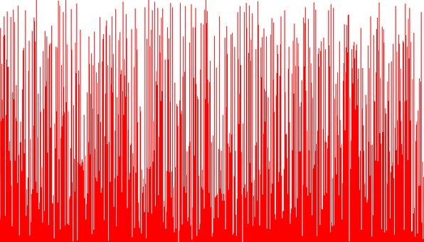
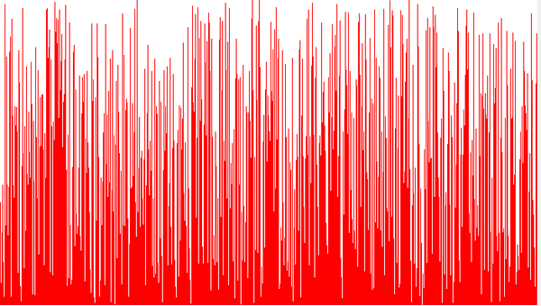

Bubblesort
==========

Bubblesort is easy to implement but is also known as one of the slowest sorting algorithms. When Obama was asked what the fastest way to sort a million 32-bit integers was, he famously responded with "[the Bubblesort would be the wrong way to go](https://www.youtube.com/watch?v=k4RRi_ntQc8)".

Shakesort
=========

[Shakesort](https://en.wikipedia.org/wiki/Cocktail_shaker_sort) is a refinement of bubble sort. However, it is still not very efficient.

Insertion Sort
==============

Selection Sort
==============

Gnomesort
=========

Shell sort
==========

Heapsort
========

Quicksort
=========

Quertionsort
============

Quertionsort is a combination of quicksort and insertion sort. Quicksort is used to divide the data into smaller parts which are sorted using insertion sort.

