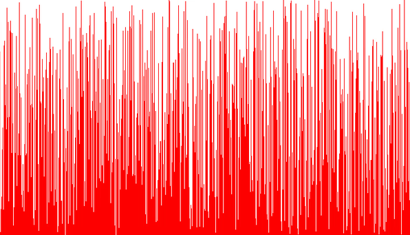
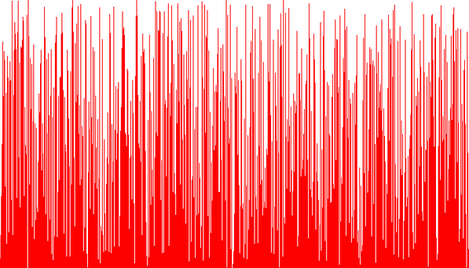

Bubblesort
==========

[Bubblesort](https://en.wikipedia.org/wiki/Bubble_sort) is easy to implement but is also known as one of the slowest sorting algorithms. When Obama was asked what the fastest way to sort a million 32-bit integers was, he famously responded with "[the Bubblesort would be the wrong way to go](https://www.youtube.com/watch?v=k4RRi_ntQc8)".

The algorithm gets its name from the way it looks when elements are being sorted. Bubblesort repeatedly swaps adjacent elements until all elements are in the right order. When observing the algorithm in action, it looks like the element being sorted is "bubbling up".

Shakesort
=========

[Shakesort](https://en.wikipedia.org/wiki/Cocktail_shaker_sort) is a bi-directional bubble sort. It can be a little faster than a normal bubblesort, but it is still not very efficient and runs in O(n²).

Selection Sort
==============

[Selection sort](https://en.wikipedia.org/wiki/Selection_sort) selects the next sorted element and swaps into its correct position. While it makes the least number of swaps, the total runtime is still O(n²).

Insertion Sort
==============

[Insertion sort](https://en.wikipedia.org/wiki/Insertion_sort) takes the next unsorted element and inserts it into its correct position, similarly to how most people are sorting their hand when playing cards. This is very effective on smaller data sets (less than 10-20 elements) but its still not effective on larger sets of data.

Gnomesort
=========

[Gnomesort](https://en.wikipedia.org/wiki/Gnome_sort) (also known as stupid sort) is a variant of insertion sort. As the name suggests its not much better than the other sorting algorithms mentioned so far.

Shellsort
=========

[Shellsort](https://en.wikipedia.org/wiki/Shellsort) is an improvement over insertion sort. It divides the elements to be sorted into smaller lists, and then sorts each individual list with insertion sort. The algorithm repeats with larger and larger lists until the whole list is sorted. While it can run in O(n × log(n)), its worst case runtime is still O(n²).

Quicksort
=========

[Quicksort](https://en.wikipedia.org/wiki/Quicksort) is one of the fastest sorting algorithms. It selects a pivot elements and then puts all smaller elements to the left and all larger elements to the right. The left and the right part are then sorted again using the same algorithm.

It typically runs in O(n × log(n)) time, but it can run in O(n²) if the "wrong" pivot element is chosen.

Quertionsort
============

Quertionsort is a combination of quicksort and insertion sort. Quicksort is used to divide the data into smaller parts which are sorted using insertion sort.

Heapsort
========

[Heapsort](https://en.wikipedia.org/wiki/Heapsort) builds a datastructure called a [heap](https://en.wikipedia.org/wiki/Heap_(data_structure)) and then repeatadly selects the next sorted element from this heap, until all elements are sorted. While this algorithm is guaranteed to run in O(n × log(n)), Quicksort is often faster in practice.

